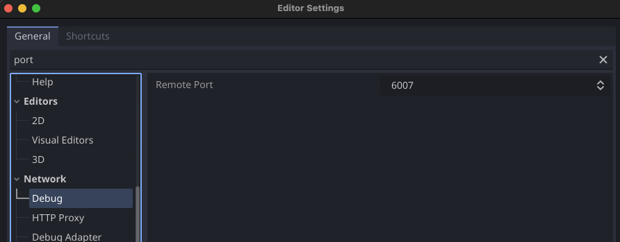
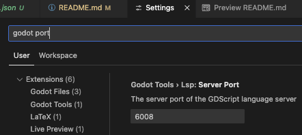

# Fork
- use godot plugin for vscode
- adjust port to match port from godot
- add vscode exe to godot settings

- match ports between vscode extension and godot


- add to .vscode/settings.json
```
{
  "godotTools.editorPath.godot4": "/Users/hochmax/Downloads/Godot.app"
}
```
  - select f1 debug godot from vscode
# AgOpenGPSSimPoC

Proof of concept simulator ("digital twin"?) made with Godot game engine for AgOpenGPS.  
Video about testing here:  
https://youtu.be/4QyAIUzLqAU  
Video about testing a new version with a lot of improvements and force feedback steering wheel support:  
https://youtu.be/OvIh3iD0RC8

Uses Godot game engine (and it's physics engine) to simulate tractor's behavior in a virtual world. Steering commands are received from and latitude/longitude/height/heading/roll/etc are sent to AgOpenGPS (or actually AgIO) using UDP-protocol. From the AgOpenGPS' (AgIO's) perspective this basically emulates All-In-One-board's (V4.1) UDP-communication as implemented in teensy-code. This emulation, however, implements only minimum set of features to get this working somehow (as this is just a PoC after all).

Made with Godot version 4.2.1, which you can download here: https://godotengine.org/download/archive/4.2.1-stable/ This should be multi-platform (apart from the force feedback support) but I have only more thoroughly tested this in windows 10 for now. I couldn't get steering wheel force feedback working on Linux (only tested this quite quickly in Mint), but it should be possible.

Requirements should not be very high, I'd guess any mid-range laptop manufactured during the last 5 years or so should probably be enough to run this. Standard-version ( https://github.com/GNSS-Stylist/AgOpenGPSSimPoC/tree/main ) needs vulkan, but there is a lighther version using OpenGL-renderer on another branch: https://github.com/GNSS-Stylist/AgOpenGPSSimPoC/tree/OpenGL_renderer .

You can drive around the virtual world using keys and UI-controls in the left upper corner. Or if you have a joystick or steering wheel, also using those. You may need to remap controls from the Project Settings->Input Map on Godot, though.

Default controls:

- W,S,A,D: control tractor's speed and steering
- End: Set tractor's target speed to 0 and steering straight
- Home: Engage/disengage automatic steering
- F1: Switch to "First person flyer" camera (use CTRL to activate/deactivate mouse look)
- F2: Switch to follow camera
- F3: Switch to tractor driver's view
- F4: Switch to right-back view.
- F5: Switch to left-back view.
- F6: Switch to fixed back view.
- F12: Full screen toggle
- CTRL: Activate/deactivate mouse look for "First person flyer" camera. This needs to be deactivated before you can use your mouse for other purposes again.
- U,H,J,K & Y,I (& O,L for roll if using 6 dof-mode): Fly around with the "First person flyer" camera
- Tab: Switch between "FPS" and "6 dof" flying modes (for "First person flyer" camera)
- Mouse wheel & plus & minus keys: Change flying speed of "First person flyer" camera
- B: Create a new 300 kg ball (physics object)
- Mouse buttons (when flying with "First person flyer" camera): Activate physics "manipulators"
- T: Teleport tractor to the front of first person flyer coordinates.

Notes:

- Preferred way to use this is to set your ethernet's IP-address to 192.168.5.126 (when using the default settings on AgOpenGPS/AgIO) and connect a tablet running AgOpenGps(/AgIO) to your computer using an ethernet-cable (or using a router or something). This way you can use AgOpenGPS on your tablet as you would in a real tractor. If you, however, want to run this and AgOpenGPS on the same computer, you can do so at least using either of these 2 methods:
  - Use Hyper-V Manager (you should find this in your start-menu if installed, should be available as an additional installable feature for windows 10 & 11 at least in some (at least pro?) editions) to create a new internal virtual switch:
    - In Hyper-V Manager select "Virtual Switch Manager"->"New  virtual network switch"->"Internal"->Create Virtual Switch". Give it a name (like "AgOpenGPS") and press "Ok".
    - You can now assign multiple IPs to the new adapter: From connection's "Properties"->Internet Protocol Version 4 (TCP/IPv4)" -> Select "Use the following IP address"->Select "Advanced" -> "IP address" -> "Add". Add here "192.168.5.10" (for AgOpenGPS) and "192.168.5.126" (for the simulator). These settings should work with the default "Subnet" in AgOpenGPS. Also check that there are no conflicts. You may use other address spaces as well, just remember to change the settings in AgIO and the simulator ("Settings" -> "UDP" -> "Subnet").
  - Due to the way AgOpenGPS/AgIO uses UDP broadcast messages it is also possible to run this on the same computer as the AgOpenGPS/AgIO without creating a "real" (including virtual as above) network. For this to work (with the default settings in AgOpenGPS and the simulator) you need to set your ethernet IP to 192.168.5.10. The laptop I'm using seems to also require that the ethernet cable is connected to something (can be even another laptop, seems to just need some kind of lower level connection to wake up). Requirements on other systems may differ.
- You may need to allow firewall to pass Godot Engine's traffic as this uses UDP-protocol for communication.
- Simulated area is located in the middle of South Atlantic ocean (near zero latitude/longitude). This was done to make calculations much easier (this being just a PoC...).
- Based on dual antenna setup (although only one antenna can be seen, because teensy-code calculates heading/roll internally and therefore there's no need for the location of the second antenna here). You need to configure AgOpenGPS/AgIO accordingly.
- Tractor model was downloaded from Sketchfab and made by ahmadbaroud ( https://skfb.ly/oS6ZJ ). This tractor has a wheelbase 2.64 m, antenna location is 0 cm, 290 cm up and 50 cm right (I remember there being some strange discrepancy in the sideway coordinates when testing the real setup and now looking at the simulated tractor and setting in AgOpenGPS they do not seem to match... Not investigating this further now, though. If trying this, just use -50 to sideways shift-setting).

Uses:

- Tractor (3D-model) by ahmadbaroud:
  
  https://skfb.ly/oS6ZJ
  license: CC BY 4.0 ( https://creativecommons.org/licenses/by/4.0/ )
  These modification were made to the original model:
  
  - The original model was "disassembled" to separate objects.
  
  - Tires and rims were separated from the original model and reconstructed in Godot Engine to make them usable in the simulated tractor. Their locations have been changed a bit.
  
  - Front axle was replaced with one modeled in Godot Engine.
  
  - Some parts of the cabin were separated from the rest of the body to make them hideable (mostly to make view from the cabin less obstructed).
  
  - Steering wheel was replaced with another model (this change doesn't actually affect this model, but the replacement steering wheel is shown in the place of the original one).

- Steering wheel (3D-model) by sedayuzlu:
  
  https://skfb.ly/oF7Nu
  license: CC BY 4.0 ( https://creativecommons.org/licenses/by/4.0/ )

Also uses:

- godot_ffb_sdl GDExtension (=plugin) ( https://github.com/Dechode/Godot-FFB-SDL ) for steering wheel force feedback support.
- Snippets from the AgOpenGPS teensy code ( https://github.com/AgHardware/Boards/tree/main/TeensyModules/AIO%20Micro%20v4/Firmware/Autosteer_gps_teensy_v4 )
- And of course Godot Engine ( https://godotengine.org/ )

Otherwise (not counting the 3rd party assets mentioned above) this project is released under GPLv3-license. So you need to follow the individual licenses if using any part of this to your purposes.

Sources and assets can be found from this project's github repo: https://github.com/GNSS-Stylist/AgOpenGPSSimPoC
